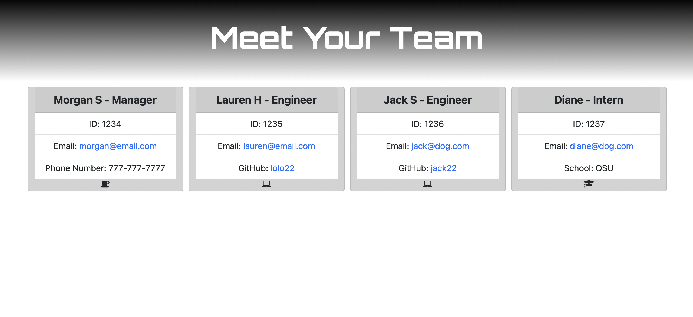

# team-profile-generator
A TDD application that on a Node.js command-line application that takes in information about employees on a software engineering team, then generates an HTML webpage that displays summaries for each person.

## Table of Contents
  
  - [Installation](#installation)
  - [Usage](#usage)
  - [GIF](#gif)
  - [screenshot](#screenshot)
  - [Testing](#testing)
  - [Support](#support)
  - [Contributing](#contributing)
  - [License](#license)
  - [Questions](#questions)
  
## Installation

  The key tools to making this project work are npm. The user must run “npm init -y” to get the npm data and then install the rpm inquirer packages by running “npm i inquirer”. This will allow the user to access the key packages of node that make this function. The user will be promted through questions then the program takes care of the rest.

  
## Usage
  
  This program is useful for any work place looking to make a simple directory of employeees! It is easily customizable and will generate as many employees as they see fit. A user is easily prompted through questions to obtain the informtation about each user to make a profile.

## Gif 

  

## Screenshot of Sample Page 
  
  
## Testing

 There are 4 testing files to test each of the constructors that make up the basis of the team profile. We create a base employee constructor which gives the user an object that includes name, id, and email, because every employee has that. From there we created the Manager who has an office number, the Engineer who links their github, and the Intern who lists the school they intern from. The tests are in the test file ensure you have npm i jest to make sure the testing node is installed. The user can then run npm run test and either run specfic test files or all the tests!
  
## Support
  
  Please [open an issue](https://github.com/mschall217/team-profile-generator/issues/new) for support.
  
## Contributing
  
  My tutors/TAs/Classmates! Thanks as always!
  
## License

  MIT License

    Copyright (c) 2021 Morgan Schall
    
    Permission is hereby granted, free of charge, to any person obtaining a copy
    of this software and associated documentation files (the "Software"), to deal
    in the Software without restriction, including without limitation the rights
    to use, copy, modify, merge, publish, distribute, sublicense, and/or sell
    copies of the Software, and to permit persons to whom the Software is
    furnished to do so, subject to the following conditions:
    
    The above copyright notice and this permission notice shall be included in all
    copies or substantial portions of the Software.
    
    THE SOFTWARE IS PROVIDED "AS IS", WITHOUT WARRANTY OF ANY KIND, EXPRESS OR
    IMPLIED, INCLUDING BUT NOT LIMITED TO THE WARRANTIES OF MERCHANTABILITY,
    FITNESS FOR A PARTICULAR PURPOSE AND NONINFRINGEMENT. IN NO EVENT SHALL THE
    AUTHORS OR COPYRIGHT HOLDERS BE LIABLE FOR ANY CLAIM, DAMAGES OR OTHER
    LIABILITY, WHETHER IN AN ACTION OF CONTRACT, TORT OR OTHERWISE, ARISING FROM,
    OUT OF OR IN CONNECTION WITH THE SOFTWARE OR THE USE OR OTHER DEALINGS IN THE
    SOFTWARE.
  
## Questions 
  If you have any questions or concerns please reach out to Morgan Schall on GitHub at mschall217 or email at morgan.allison.schall@gmail.com 
  
  